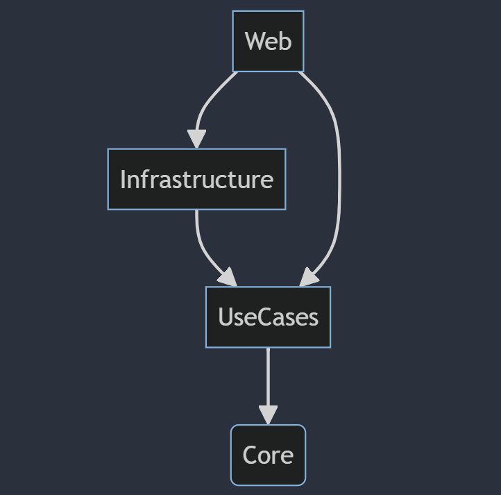

# [Sujet](Sujet.md)

# Architecture Overview

This solution embodies clean architecture principles and follows the Domain-Driven Design (DDD) methodology.

## Project Structure

### Core Project

The **Core** project serves as the foundation, defining entities and encapsulating business logic pertaining to bank accounts and transactions.

### UseCases Project

In the **UseCases** project, business use cases are implemented, orchestrating application behavior and interacting with Core entities.

### Infrastructure Project

The **Infrastructure** project manages I/O devices, implementing database access, and a (fake) client to external web services. It acts as a bridge between the application and external systems.

### Web Project

The **Web** project, a Web API, exposes three endpoints:

- **GET /Accounts**: Lists all accounts with their balances.
- **GET /Accounts/{AccountId}**: Returns a specific account with its balance and all associated transactions.
- **POST /Accounts/{AccountId}/Transactions**: Allows adding a transaction to a specific account.
  **Hint**: Transaction types are _"Deposit"_ and _"Withdrawal"_.

### Test Projects

Three test projects facilitate comprehensive testing:

- **Unit Tests**: Focuses on testing the business logic and the use cases.
- **Integration Tests**: Group-tests features.
- **Functional Tests**: Verifies that the application functions correctly from an end-to-end perspective.

## Dependency Diagram



# Build

## Prerequisites

Ensure you have [.NET 8.0 SDK](https://dotnet.microsoft.com/en-us/download/dotnet/8.0) installed.

## Build Steps

```shell
> dotnet build
```

# Run

## Prerequisites

Make sure you have the [ASP.NET Core Runtime 8.0](https://dotnet.microsoft.com/en-us/download/dotnet/8.0) installed. You already have it if you installed the SDK from the build step.

## Run Steps

```shell
> cd src/ExaltIt.BankAccount.Web/
> dotnet run
```

an SQLite database _"database.sqlite"_ and log files are generated in the web project when you run the application.

# Test

To run tests (unit, integration, functional):

```shell
> cd tests/ExaltIt.BankAccount.<TestProject>/
> dotnet test
```
